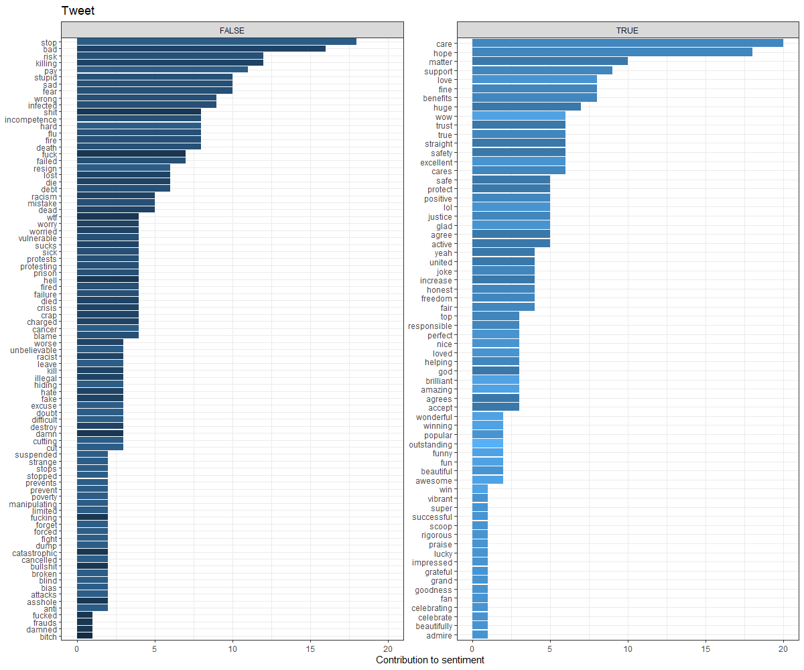

```{r setup, include=FALSE}
knitr::opts_chunk$set(echo = FALSE, warning = FALSE)

library(cluster) #contains daisy algorithm and some other useful cluster analysis tools https://www.rdocumentation.org/packages/cluster/versions/2.1.0/topics/daisy
library(dplyr) #elegent data management
library(dendextend) #draw pretty dendregrams
library(ggplot2) #pretty charts
library(purrr) # pretty data management
library(ggwordcloud)
library(knitr)

#read provided data for use in presentation
DF <- read.csv("./data/tweets.csv")

#drop .csv id, and the joining variables, reply_to_status_id and status_id
DF <- DF[,-c(1,3,6)]

#remove bad (non news) stems
bad_stem <- c("at.pysc.al", "goodfund.us", "spr.ly")
DF <- DF[!(DF$uri_stem %in% bad_stem),]

#create ordered categorical for short, medium, and long tweets
DF$lms <- 1
DF[DF$ncar <40,]$lms <- 0
DF[DF$ncar >150,]$lms <- 2
DF$lms <- as.ordered(DF$lms)

#coerce sentiments into ordered factor
DF$sent <- ordered(DF$sent)
#coerce uri's into factors and rename
DF$uri_stem <- as.factor(DF$uri_stem)

#create ordered categorical for sentiment values
#DF$sent4class <- as.numeric(cut(DF$sent,c(-16,-2,0,2,10)))

#create data frame of variables to use for dissimilarity matrix
forAnalysis <- c("ncar","sent","uri_stem")
DFDaisy <- DF[names(DF) %in% forAnalysis]

#build dissimilarity matrix
dmatrix <- daisy(DFDaisy, metric = "gower")

#clust top down
#d.clust <- diana(as.matrix(dmatrix), diss = TRUE, keep.diss = TRUE)

#heirarchical clustering 
c.clust <- hclust(dmatrix, method= "complete")

#assign classes for k1...k6

DF$K2 <- cutree(c.clust, k = 2)
DF$K3 <- cutree(c.clust, k = 3)
DF$K4 <- cutree(c.clust, k = 4)
DF$K5 <- cutree(c.clust, k = 5)
DF$K6 <- cutree(c.clust, k = 6)


colors4 <- c("darkslategray", "darkslategray4", "gold3", "gold4")

DFK2Counts <- DF %>%
  group_by(K2, uri_stem) %>%
  select(c(uri_stem)) %>%
  summarize(n())

#base on code from Anastasia Reusova https://towardsdatascience.com/hierarchical-clustering-on-categorical-data-in-r-a27e578f2995
dendro <- as.dendrogram(c.clust)
dendro.col <- dendro %>%
  set("branches_k_color", k = 4, value =  colors4) %>%
  set("branches_lwd", 0.6) %>%
  set("labels_colors", 
      value = c("darkslategray")) %>% 
  set("labels_cex", 0.5)
ggd1 <- as.ggdend(dendro.col)

ggdenroplot <- ggplot(ggd1, theme = theme_minimal()) +
  labs(x = "Num. observations", y = "Height", title = "Dendrogram, k = 4")

# for basic instructions on geom_text_Wordcloud_area  
#https://cran.r-project.org/web/packages/ggwordcloud/vignettes/ggwordcloud.html
set.seed(1000)
DF %>%
  group_by(K3, uri_stem) %>%
  #select(c(uri_stem, K3, sent)) %>%
  summarize(count = n(), "avg_sent" = mean(as.numeric(as.character(sent)))) %>%
  ggplot(aes(label = uri_stem, color = as.factor(K3) , size = abs(avg_sent))) +
  geom_text_wordcloud_area()  +
  ggtitle("Mean Sentiment Strength Across Groups") +
  scale_color_manual(values = c("darkslategray", "gold", "purple")) -> ggwordcloudplotSentK3


set.seed(1000)
DF %>%
  group_by(K3, uri_stem) %>%
  #select(c(uri_stem, K3, sent)) %>%
  summarize(count = n(), "avg_length" = mean(ncar)) %>%
  ggplot(aes(label = uri_stem, color = as.factor(K3) , size = avg_length)) +
  geom_text_wordcloud_area()  +
  ggtitle("Mean Text Length Across Groups") +
  scale_color_manual(values = c("darkslategray", "gold", "purple")) -> ggwordcloudplotlengthK3

set.seed(1000)
DF %>%
  group_by(K4, uri_stem) %>%
  #select(c(uri_stem, K4, sent)) %>%
  summarize(count = n(), "avg_sent" = mean(as.numeric(as.character(sent)))) %>%
  ggplot(aes(label = uri_stem, color = as.factor(K4) , size = abs(avg_sent))) +
  geom_text_wordcloud_area()  +
  ggtitle("Mean Sentiment Strength Across Groups") +
  scale_color_manual(values = c("darkslategray", "darkslategray4", "gold", "gold4")) -> ggwordcloudplotSentK4


set.seed(1000)
DF %>%
  group_by(K4, uri_stem) %>%
  #select(c(uri_stem, K4, sent)) %>%
  summarize(count = n(), "avg_length" = mean(ncar)) %>%
  ggplot(aes(label = uri_stem, color = as.factor(K4) , size = avg_length)) +
  geom_text_wordcloud_area()  +
  ggtitle("Mean Text Length Across Groups") +
  scale_color_manual(values = c("darkslategray", "darkslategray4", "gold", "gold4")) -> ggwordcloudplotlengthK4


```

## Background: Epidemology and Communication

SARS-CoV-2 is an emergent disease that rapidly achieved pandemic status

- Airborne and Highly Communicable

- Most infected are not diseased but at least many of them are infectious

- Control of outbreaks requires behavior change

- Messaging must be done well

## Twitter Usage

Twitter is a major communications platform utilized by 27% of Americans. This far reach prompts significant use by media outlets.

- Over half of all journalist microblog, citing Twitter as their primary platform

- About 12% of Americans use twitter for news

    - Facebook (43%) and Youtube (21%), while more popular, are less studyable
    
## Sentiment Analysis

Sentiment analysis is a family of approaches to quantify characteristics of meaning and attitude in human communication. Dictionary based sentiment analysis uses a dictionary of word-sentiment pairs to assign scores to words used in a communication. 

- Capture non-syntactic characteristics of language, such as emotional states

- Amenable to high-throughput analysis

- Are domain specific and inherently biased

## Research Question

Exploration of the relationship between sentiment and media messaging may provide insight into how people respond to messaging from different sources and motivate further research.

This study uses cluster analysis to explore relationship between the sentiments and news source among those who reply to COVID-19 related tweets.

## Method: Twitter Data

US tweets classified as "news" that included the hashtag "covid19" (N 3998), and their replies (N 895) were retrieved through the Twitter API. For news sources, we identified the news source by the url referenced.

The text of each reply tweet was given a sentiment score using the tidytext implementation of F. Nielsen's twitter sentiment dictionary. Prior to scoring, text were cleaned for for non-word characters. Because it appears often, and is part of the AFINN dictionary, the word "trump" was removed from scoring.

## Method: Analysis

In order to optimize information available from our data, we calculate a dissimilarity matrix using the approach of Kaufman and Rousseeuw implemented in the R cluster::daisy function. Their approach includes implementation of a dissimilarity measure proposed by Gower (1964) capable of representing various data type. 

## Method: Analysis

The model is specified as:

$$d_{ij} = d(i,j) = \frac{\sum^p_{k=1}w_k\delta^{(k)}_{ij}d^{(k)}_{ij}}{\sum^{p}_{k=1}w_k\delta^{k}_{ij}} $$
Where, for dissimilarity $d$ for observations $i$ & $j$, $p$ variables and $w$ as an optional weighting variable, $\delta$ as an indicator of missingness, where it is 0 when either variable is missing, and $d$ is our indication of similarity.

Using this approach, our form of $d^{(f)}_{ij}$ varies for each variable type, but always takes a value between 0 and 1 inclusive. 

Heirarchical clustering was then applied to the matrix to explore classification. 

## Methods: Analysis

variable type      response description   
---------------  ------------------------ 
nominal             1 if match, else 0
binary              1 if match, else 0
ordinal             stndzd difference
continuous          stndzd difference


## Results: Data

Variable           description                                 Presence    
--------- --------------------------------- ---------------------------
tweet id      unique id of tweet                                  N 878
lms       3 level indicator of length                M1.2, min 0, max 2
sent       4 level indicator of sentiment        M-0.8, min -15, max 9
source        root source of news                          129 (unique)

## Results: Sentiment



## Results: Mean Across Groups
```{r}

kable(rbind(DF %>%
  group_by(K2) %>%
  
  summarise("mean_sent" = mean(as.numeric(as.character(sent))), mean_char = mean(ncar), org_count = n_distinct(uri_stem), mess_count = n()) %>%
  mutate(Kmax = "K2") %>%
    arrange(mean_sent) %>%
    select(-c("K2"))
  ,
DF %>%
  group_by(K3) %>%
  
  summarise("mean_sent" = mean(as.numeric(as.character(sent))), mean_char = mean(ncar), org_count = n_distinct(uri_stem), mess_count = n()) %>%
  mutate(Kmax = "K3") %>%
  select(-c("K3"))
,
DF %>%
  group_by(K4) %>%
  
  summarise("mean_sent" = mean(as.numeric(as.character(sent))), mean_char = mean(ncar), org_count = n_distinct(uri_stem), mess_count = n()) %>%
  mutate(Kmax = "K4") %>%
  select(-c("K4"))
,
DF %>%
  group_by(K5) %>%
  
  summarise("mean_sent" = mean(as.numeric(as.character(sent))), mean_char = mean(ncar), org_count = n_distinct(uri_stem), mess_count = n()) %>%
  mutate(Kmax = "K5") %>%
  select(-c("K5"))
,
DF %>%
  group_by(K6) %>%
  
  summarise("mean_sent" = mean(as.numeric(as.character(sent))), mean_char = mean(ncar), org_count = n_distinct(uri_stem), mess_count = n()) %>%
  mutate(Kmax = "K6") %>%
  select(-c("K6"))
) %>%
  
  arrange(Kmax,-mean_sent)
)

```

## Results: Dendrogram

```{r}

plot(ggdenroplot)
```

## Results: Sentiment K3

```{r}
plot(ggwordcloudplotSentK3,)

```

## Results: Length K3

```{r}
plot(ggwordcloudplotlengthK3)
```

## Results: Sentiment K4

```{r}
plot(ggwordcloudplotSentK4)

```

## Results: Length K4

```{r}
plot(ggwordcloudplotlengthK4)
```


## Conclusions

- Our gray cluster has a higher proportion of low sentiment mean sentiments.

- The darker gray cluster has stronger sentiments than the lighter gray cluster

- mean length seems scattered similarly across groups

- 2 or three clusters appears to capture 


## Limitations

- The use of an off-the-shelf word-dictionary is likely a poor fit for our sentiment 

- The lack of information about news sources, and didactic content of messages suggest this is not likely to be a good description

- Twitter data are not clean or necessarily representative of population level behavior. It is unlikely to be reflective of national or regional responses.


## Questions?

buierw@uw.edu

https://github.com/rwbuie/twitter_sentiment


